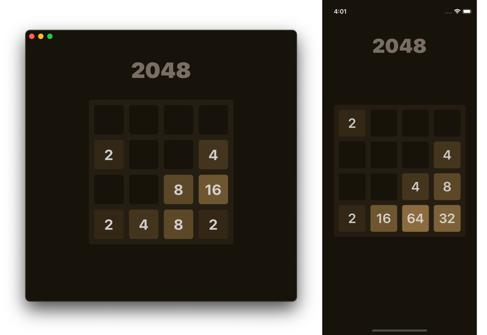

# 2048 Game

This is a simple 2048 game with a dark theme written in Swift using the SwiftUI framework.

> The game algorithm may have issues, and this is still WIP.

## Supported Platforms

* iOS 13.0+
* macOS 10.15+
* macOS 11+ (macCatalyst version)

## License

MIT
